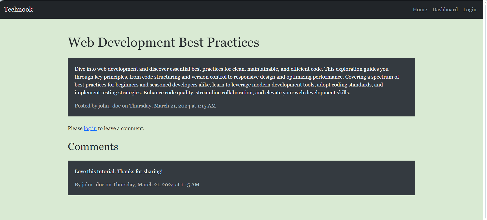
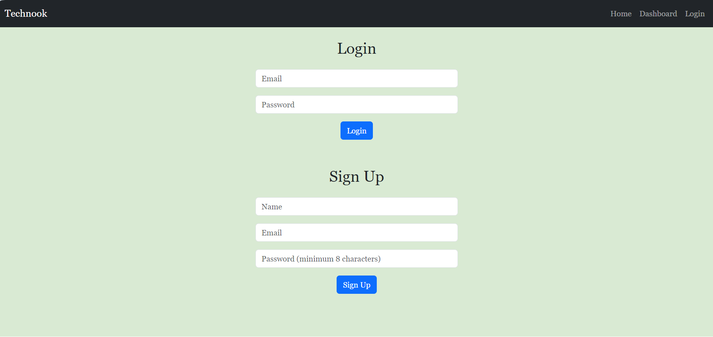
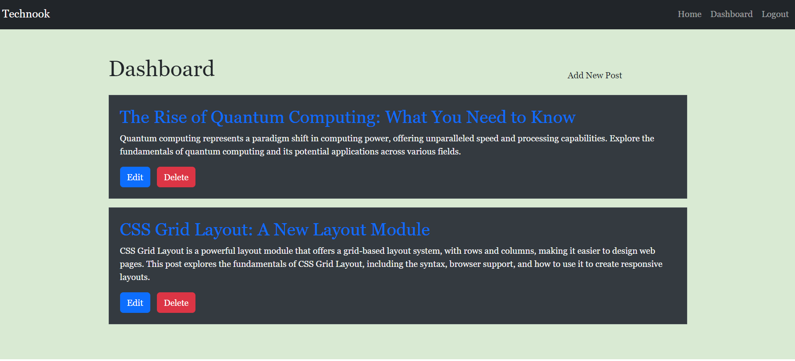
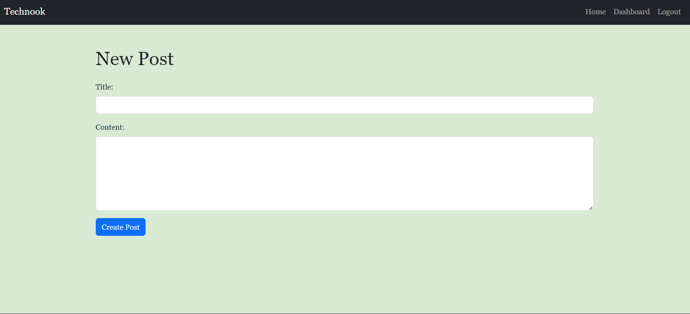

# Technook

## Description

Technook CMS is a content management system developed for developers seeking to publish insightful articles, blog posts, and express opinions on diverse technical subjects. Adhering to the MVC architecture. This application was created from scratch, leveraging Handlebars.js for streamlined templating, Sequelize as the ORM for seamless data management, and the express-session npm package to ensure secure authentication. Whether you're an experienced developer or embarking on your coding journey, this feature-rich CMS-style blog site offers an ideal environment for knowledge sharing and continuous learning."

## Table of Contents

- [Installation](#installation)
- [Application Sample](#application-sample)
- [Reference](#reference)
- [License](#license)
- [Questions](#questions)

## Installation

No installation required. To access the application, simply visit the following link: https://enigmatic-chamber-32790-18fab8422eec.herokuapp.com

## Application Sample

Sample image of the application shown :

## Reference

- [Node.js](https://nodejs.org/en/)
- [Express.js](https://expressjs.com/)
- [Sequelize](https://sequelize.org/)
- [Handlebars.js](https://handlebarsjs.com/)
- [MySQL](https://www.mysql.com/)
- [Bootstrap](https://getbootstrap.com/)
## License

MIT license was used for this application.

## Questions

For any questions, please contact me at <karina.yukting.li@gmail.com>.
GitHub Profile: https://github.com/karina-yuk
